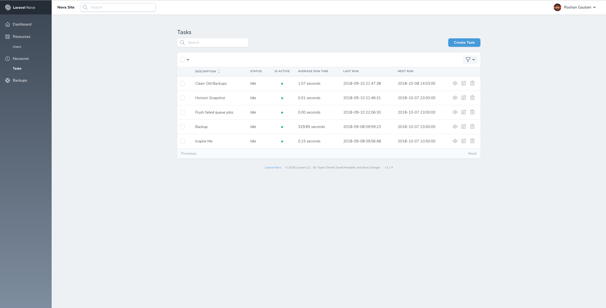
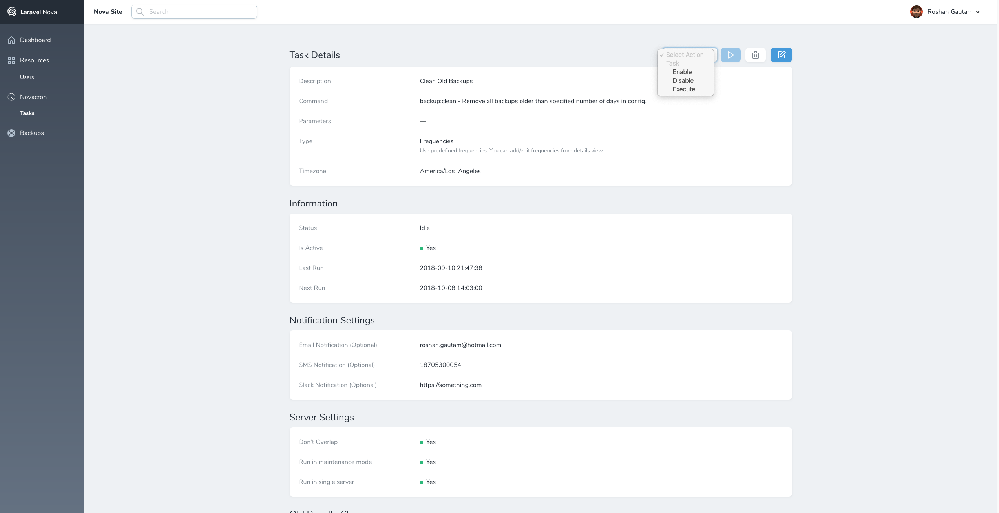
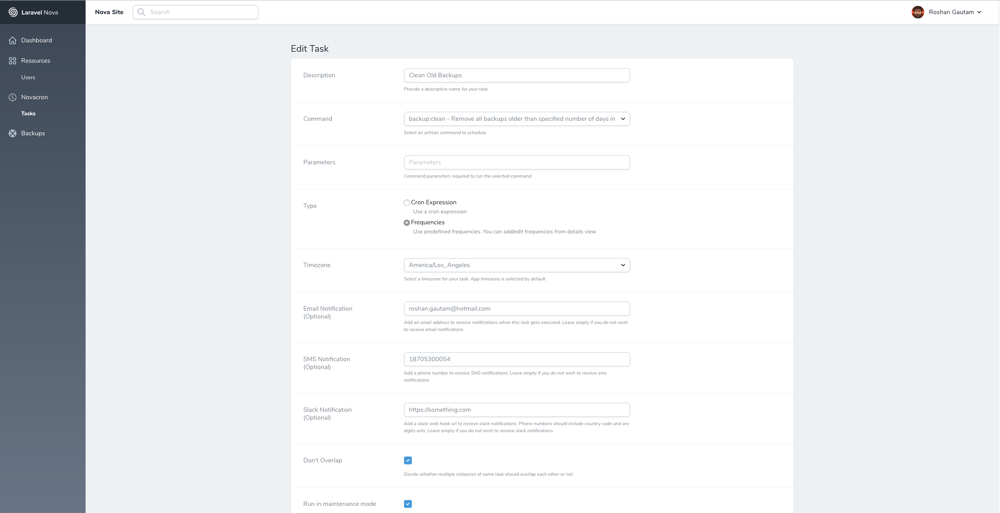

# Novacron

[](https://travis-ci.org/codestudiohq/novacron) [](https://styleci.io/repos/99050894) [](https://packagist.org/packages/studio/novacron) [](https://packagist.org/packages/studio/novacron) [](https://packagist.org/packages/studio/novacron)

***Warning : This is an in flight alpha Version. Please use at your own risk***

Manage your `Laravel` schedule through `Nova`.

## Installation

You can install the package in to a Laravel app that uses [Nova](https://nova.laravel.com) via composer:

```bash
composer require studio/novacron
```

Next up, you must register the tool with Nova. This is typically done in the `tools` method of the `NovaServiceProvider`.

```php
// in app/Providers/NovaServiceProvider.php

// ...

public function tools()
{
    return [
        // ...
        new \Studio\Novacron\Novacron(),
    ];
}
```

## Usage

Click on the "Novacron" menu item in your Nova app to see the features provided by this package.

## Testing

``` bash
composer test
```
## Screenshots

##### Task Index View



##### Task Details View



##### Task Edit View



## Changelog

Please see [CHANGELOG](Changelog.md) for more information on what has changed recently.

## Contributing

Please see [CONTRIBUTING](Contributing.md) for details.

## Security

If you discover any security related issues, please email opensource@codestudiollc.com instead of using the issue tracker.


## Credits

- [Roshan Gautam](https://github.com/roshangautam)

## License

The MIT License (MIT). Please see [License File](License.md) for more information.
